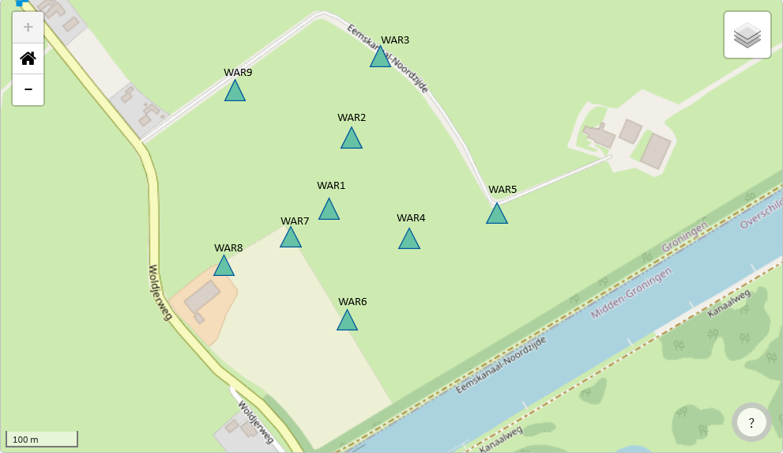
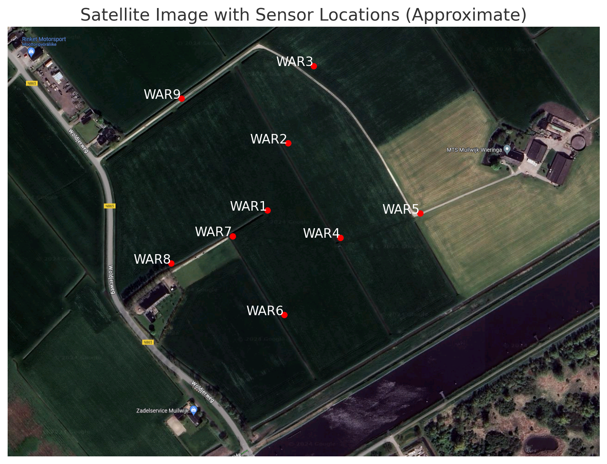
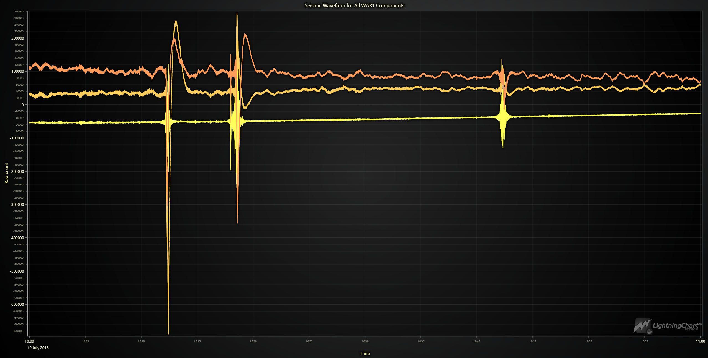
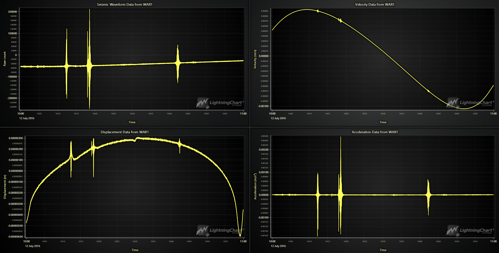

# Seismic Array in Wittewierum, Netherlands – Python Exercise

## Note to Readers

This article serves as an overview of the project. For detailed visualizations and code examples, it is highly recommended to refer to the accompanying Jupyter Notebook file: `seismicAnalysis_Netherlands.ipynb`. The notebook contains all the code, comments, and outputs necessary to understand this project's data processing and visualization techniques fully.

## Introduction

This project focuses on analyzing seismic data collected from a network of sensors in Wittewierum, Netherlands. The dataset provides valuable insights into the region's microseismicity, critical for understanding natural and induced seismic activities. These sensors, installed at a shallow depth of approximately 1 meter, were primarily designed to monitor microseismic events. The shallow installation allows for high-resolution data collection of local seismic activity, although it also makes the sensors susceptible to recording surface-level activities.

## LightningChart Python

### Overview of LightningChart Python Usability for this Specific Project

LightningChart Python is an excellent tool for visualizing large-scale seismic data due to its high performance and customizable features. This project enabled the creation of detailed and interactive waveform graphs crucial for analyzing seismic events over time.

## Setting Up Python Environment

### Installing Python and Necessary Libraries

Ensure you have [Python ](https://www.python.org/downloads/)installed.

### Overview of Libraries Used

- **[NumPy](https://numpy.org/):** For numerical operations
- **[Pandas](https://pandas.pydata.org/):** For data manipulation and analysis
- **[ObsPy](https://docs.obspy.org/):** For accessing and processing seismic data
- **[LightningChart Python](https://lightningchart.com/python-charts/):** For advanced high performance data visualization

### Setting Up Your Development Environment

1. Install Python.
2. Use `pip` to install the required libraries:
   ```shell
   pip install numpy pandas obspy lightningchart
   ```
3. Set up your development environment by creating a new project directory and installing the required libraries. Ensure that LightningChart Python is properly licensed and configured.

## Loading and Processing Data

### Overview of the Data

The seismic data is collected from sensors installed at a depth of 1 meter in Wittewierum, Netherlands. These high-gain sensors were operational from July 12, 2016, to August 29, 2016, with some outages. The dataset includes three components (HHE, HHN, and HHZ) from each station, recording continuous seismic activity.

#### Map of Sensor Locations



#### Satellite image with Sensor Locations



These images help visualize the geographic distribution of the sensors.

### How to Load the Data

Using ObsPy, you can access and download the seismic data:

```python
from obspy.clients.fdsn import Client
from obspy import UTCDateTime

client = Client("GFZ")

starttime = UTCDateTime("2016-07-12T00:00:00")
endtime = UTCDateTime("2016-07-12T23:59:59")
station = "WAR1"

st = client.get_waveforms(network="1C", station=station, location="--", channel="HHZ", starttime=starttime, endtime=endtime)
```

### Handling and Preprocessing Data

The data we are mainly preprocessing is the time value, so it would be displayed properly on the charts created by LightningChart Python

```python
# Get the time values in seconds from the start of the trace
x_values_seconds = st[0].times().tolist()

# Convert the start time to milliseconds
start_time = st[0].stats.starttime.timestamp * 1000

# If the time is in UTC+3, subtract 3 hours (10800 seconds) to adjust the time values
offset_seconds = 3 * 3600
x_values = [start_time + (sec - offset_seconds) * 1000 for sec in x_values_seconds]
```

Other notable preprocessing steps include converting raw waveform data into velocity, displacement, and acceleration values, ensuring accurate and meaningful visualizations. This involves numerical differentiation and integration techniques applied to the waveform data.

## Visualizing Data with LightningChart

### Creating Waveform Graphs

Here's an example of a visualization from the Jupyter Notebook file `seismicAnalysis_Netherlands.ipynb` where we generate waveform graphs to visualize seismic activity over time. This involves plotting raw waveform data for each sensor component.

```python
# Initialize the client to fetch data from GFZ
client = Client("GFZ")

# Define the start and end time for the data retrieval
# We are using the previously used start and end times
starttime = starttime
endtime = endtime
station = "WAR1"

# Fetch waveforms for all three components (Z, E, N) from the specified station and time range
st = client.get_waveforms(network="1C", station=station, location="--", channel="HH?", starttime=starttime, endtime=endtime)
st.merge(method=1)

# Separate the components into individual traces
tr_z = st.select(channel="HHZ")[0]
tr_e = st.select(channel="HHE")[0]
tr_n = st.select(channel="HHN")[0]

# Calculate time values for the traces and adjust for UTC+3
times_seconds = tr_z.times().tolist()  # Get the times in seconds
start_time_ms = tr_z.stats.starttime.timestamp * 1000  # Convert start time to milliseconds
offset_seconds = 3 * 3600  # Offset for UTC+3 in seconds
times = [start_time_ms + (sec - offset_seconds) * 1000 for sec in times_seconds]  # Adjust times

# Get data values for each component
data_z = tr_z.data.tolist()
data_e = tr_e.data.tolist()
data_n = tr_n.data.tolist()

# Create a chart with dark theme
chart = lc.ChartXY(
    theme=lc.Themes.Dark,
    title='Seismic Waveform for All WAR1 Components'
)

# Remove the default x-axis and set up a custom one
chart.get_default_x_axis().dispose()
chart.get_default_y_axis().set_title("Raw count")

x_axis = chart.add_x_axis(axis_type='linear-highPrecision')
x_axis.set_tick_strategy('DateTime')  # Set the x-axis to display date-time values
x_axis.set_scroll_strategy('progressive')
x_axis.set_title("Time")

# Add waveform series for each component to the chart
waveform_series_z = chart.add_line_series().append_samples(x_values=times, y_values=data_z).set_name('HHZ').set_line_thickness(2)
waveform_series_e = chart.add_line_series().append_samples(x_values=times, y_values=data_e).set_name('HHE').set_line_thickness(2)
waveform_series_n = chart.add_line_series().append_samples(x_values=times, y_values=data_n).set_name('HHN').set_line_thickness(2)

# Open the chart
chart.open()
```



### Streaming and Updating Data in Real-Time

Although not implemented in this project, LightningChart Python allows for real-time data streaming and updating, which is beneficial for continuous monitoring applications.

### Displacement and Acceleration Visualizations

In addition to waveform and velocity visualizations, displacement and acceleration charts were created. These visualizations typically show lower values due to the sensors' focus on detecting microseismic events. Microseismicity involves small-scale seismic events with minor ground movements, leading to lower values in these physical units.

### Dashboard Visualization

This visualization is also from the Jupyter Notebook file `seismicAnalysis_Netherlands.ipynb` where we combined aforementioend data from WAR1 sensor into one dashboard



## Additional Context

The sensors used in this project were installed at a depth of 1 meter and designed to monitor microseismic events. While beneficial for high-resolution data collection, this shallow installation also made the sensors prone to picking up surface activities. The Netherlands experiences natural and induced seismic activities, with natural tectonic movements in the southeast and induced seismicity due to gas extraction in the northeast, where this temporary array of sensors was also installed. Additionally, we do not know from the source whether the ground around the sensors was being stimulated, so we cannot be 100% sure of the cause of the recorded ground movements.

## Challenges Encountered

Accessing the complete 49 days worth of data was time-consuming, and data retrieval through ObsPy proved inefficient. Due to time constraints, smaller chunks of data were used to manage the analysis.

## Conclusion

### Recap of the Python Data Processing Workflow

This project demonstrated the process of accessing, processing, and visualizing seismic data using LightningChart Python. The workflow included data acquisition from ObsPy, preprocessing, and creating detailed visualizations.

### Benefits of Using LightningChart Python

LightningChart Python proved to be an effective tool for handling large-scale seismic data visualizations, offering high performance and customization options crucial for seismic data analysis.

## Sources

* [GEOFON](https://geofon.gfz-potsdam.de/doi/network/1C/2016)
* [EGU - European Geoscienses Union](https://nhess.copernicus.org/articles/22/41/2022/#Ch1.F2)
* Google Maps
